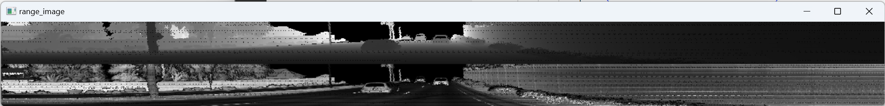

# Writeup: Mid-Term Project: 3D Object Detection

### This writeup describes the findings of Step 1 Exercise 2
#### Belongs to repository https://github.com/irassi/nd013-c2-fusion-starter

## Stable characteristics
### The objects in the images have varying levels of detail based on their distance from the LiDAR sensor and the level of interference from other objects in the path. The objects seem car-like to the trained eye, but as shown in the images below, they come in a variety of shapes. The roof line, or upper limits of the object, come across well from the point clouds, but there is great variability among them.
### Perhaps more easily distinguishable characteristics would be the shape of the windows, which appear as negative space, or the wheels. These two feature can be expected to be found from most road vehicles, but they can be less visible in the point clouds from certain angles.

### Sideview mirrors can be clearly seen poking out from many of the vehicles, in a very predictable way

## Partially visible
### Objects near the origin may appear slightly cut off due to the blind spot of the LiDAR sensor. In these cases you still have some of the defining characteristics, mainly roof line and window shapes.

## Range & intensity images from EX1
### Range and intensity images from EX1 show a similar view of vehicles compared to the point clouds. In the intensity images you can find some finer details such as licence plates, which can be a stable detection element.

