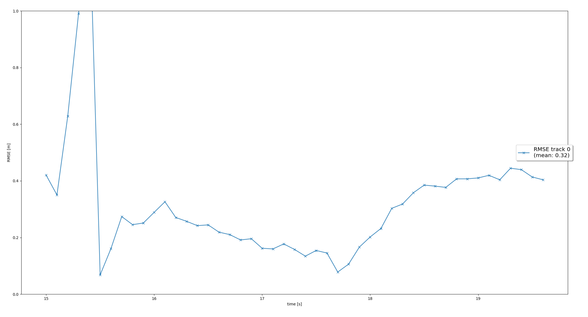
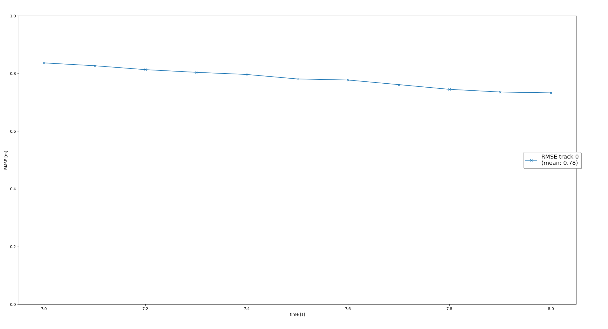

# Writeup: Track 3D-Objects Over Time

Please use this starter template to answer the following questions:

### 1. Write a short recap of the four tracking steps and what you implemented there (filter, track management, association, camera fusion). Which results did you achieve? Which part of the project was most difficult for you to complete, and why?

## Step 1
In this step I implemented an *Extended Kalman Filter (EKF)* in *filter.py*. First I implemented the functions to calculate the *system matrix F* and *process noise covariance Q.*

These were then used in the calculations of the method *"predict()"* that was used to predict *state x* and *estimation error covariance P* to next timestep and then save *x* and *P* in a track.

Then in method *"update()"* I update *state x* and *covariance P* with an associated measurement and then save the *x* and *P* in a track. Methods for counting the necessary *gamma* and *S* variables is also included.

At this point in the project only one target is tracked. Resulting RMSE plot shown below.

## Step 2
In Step 2 I implemented track management to initialize and delete tracks, set a track state and a track score in *trackmanagement.py*. I created an initialization for the track values based on measurement data. The initialized track was assigned an *'initialized'* state and a track score was created. 

Method *"manage_tracks()"* is used to handle the decreasing of track score for unassigned tracks and deleting tracks based on the following criteria.

    track.state == 'confirmed' and track.score <= params.delete_threshold) \
    or track.state != 'confirmed' and (track.P[0, 0] > params.max_P \
    or track.state != 'confirmed' and track.P[1, 1] > params.max_P) \
    or (track.score < 0.05

Then the method *"handle_updated_track()"* is used to increase the track score for a given track and an set its state to *'confirmed'* if it exceeds the confirmation threshold set in the *params* or *'tentative'* otherwise.

Only one target is tracked in this step as well, resulting RMSE Plot shown below.

## Step 3
Step 3 introduced multiple target tracking to the project, by using single nearest neighbor data association to associate measurements to tracks in *association.py*. *Mahalanobis distance (MHD)* formula is used to calculate the distances between all targets and measurements. 

I initialized an *association matrix* with infinite values and update it with the MHD values only if it meets the *gating* criteria tested with the *'gating()'* method.

The RMSE Plot showing multiple tracked targets shown below. The mean values for most tracks are well below 0.1.

## Step 4
In the final step I introduced camera-lidar fusion by implementing a nonlinear camera measurement model and checking for camera visibility in *measurements.py*. 

The method *'in_fov()'* checks if the object is in the field of view for the sensor. This information is used to decide if the track score should be decreased in *trackmanagement.py*.

Method *'get_hx()'* is updated with the nonlinear camera measurement function that is used for camera sensors. 

The results of this step are shown in the RMSE Plot below and the movie file "results\my_tracking_results.avi" which unfortunately is too big to include in GitHub. The plot shows that track 0 and track 1 are followed from beginning to end without interruptions and their RMSE mean values are at a great level. Other tracks also are on average at a good range except the spikes at the ends. 

### 2. Do you see any benefits in camera-lidar fusion compared to lidar-only tracking (in theory and in your concrete results)? 

### 3. Which challenges will a sensor fusion system face in real-life scenarios? Did you see any of these challenges in the project?

### 4. Can you think of ways to improve your tracking results in the future?

